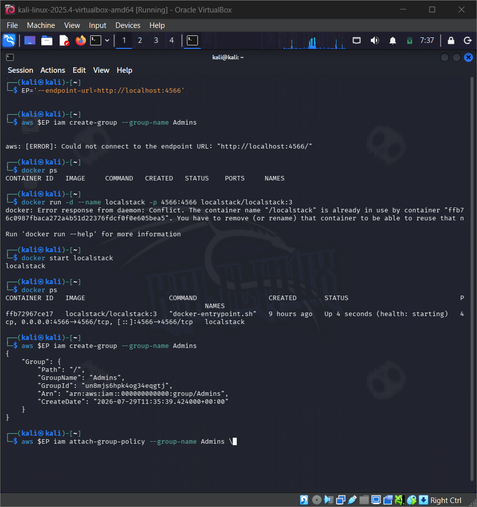

# Lab 1: Account Security and IAM Report

## Course Information

**Course:** IKB42603 Cloud Computing Security Essentials  
**Lab:** Lab 1 - Account Security and IAM  
**Session:** Session A (Week 1)  
**Name:** Student name  
**Date:** 03 August 2026  

## Objective

The objective of this lab is to complete Session A of Lab 1 using the LocalStack AWS-compatible environment. The focus is on understanding cloud identity fundamentals, applying the principle of least privilege, and demonstrating credential hygiene for IAM users in a local lab environment.

By the end of this session, the report should show that:

- Docker and LocalStack are running locally.
- AWS CLI is configured to talk to LocalStack instead of the real AWS cloud.
- An IAM group and least-privilege admin identity are created.
- A scoped read-only Analyst user is created with a limited IAM policy.
- Access keys are created and rotated for the Analyst user.

## Environment Summary

The local lab environment was verified in the Kali Linux VM used for this session.

| Component | Verified Version / Status | Evidence |
| --- | --- | --- |
| Docker | Running locally | Screenshot evidence in this report |
| AWS CLI | Configured with LocalStack endpoint | Screenshot evidence in this report |
| LocalStack | Running and healthy on port `4566` | Screenshot evidence in this report |
| IAM Interface | Commands executed through AWS CLI against LocalStack | CLI output screenshots |
| Kubernetes | Not used in Session A | Not required for Week 1 |

## Step 1: One-Time Environment Setup

Before starting the IAM tasks, the local environment must be prepared.

### 1.1 Verify Docker is available

The first command confirms that Docker is installed and working:

```bash
docker --version
```

Docker is required because LocalStack is started as a container locally.

### 1.2 Start LocalStack

The lab uses LocalStack as a local AWS-compatible simulator. The container was started with:

```bash
docker run -d --name localstack -p 4566:4566 localstack/localstack
```

A health check was then performed to verify that LocalStack was ready:

```bash
curl http://localhost:4566/_localstack/health
```

The screenshot below shows the LocalStack container being started and the health endpoint responding correctly.



## Step 2: Configure AWS CLI for LocalStack

Because this lab does not use a real AWS account, the AWS CLI must be pointed to the local endpoint.

### 2.1 Set dummy credentials

The following commands configure AWS CLI to talk to LocalStack with placeholder credentials:

```bash
aws configure set aws_access_key_id test
aws configure set aws_secret_access_key test
aws configure set region us-east-1
```

### 2.2 Test the LocalStack identity

The command below verifies the current identity seen by LocalStack:

```bash
aws --endpoint-url=http://localhost:4566 sts get-caller-identity
```

This is the first evidence screenshot because it proves which identity the environment is operating as.


## Task 1: Map the Cloud Identity Landscape

Before creating IAM resources, it is important to understand the main building blocks of cloud identity.

| Concept | AWS Term | Purpose |
| --- | --- | --- |
| All-powerful owner | Root user | The highest-privileged identity in AWS. It is powerful but should not be used routinely because it has full control over the account. |
| Human or application identity | IAM User | A named identity used to access cloud resources. IAM users can be used by people or programs. |
| Permission bundle | IAM Policy | A document that defines what actions are allowed or denied on which resources. |
| Collection of users | IAM Group | A logical container for users so common permissions can be managed together. |
| Temporary identity | IAM Role | An identity that can be assumed temporarily to gain permissions without long-lived credentials. |

## Task 2: Create a Least-Privilege Admin

The root user is dangerous because it has unrestricted access. For better security, a dedicated admin identity should be created and permissions should be granted through a group rather than directly to the user.

### 2.1 Create the Admins group

```bash
EP='--endpoint-url=http://localhost:4566'
aws $EP iam create-group --group-name Admins
```

### 2.2 Attach an admin policy to the group

```bash
aws $EP iam attach-group-policy --group-name Admins \
  --policy-arn arn:aws:iam::aws:policy/AdministratorAccess
```

### 2.3 Create a personal admin user

Example:

```bash
aws $EP iam create-user --user-name CloudAdmin_Zappy
```

### 2.4 Add the user to the Admins group

```bash
aws $EP iam add-user-to-group --group-name Admins \
  --user-name CloudAdmin_Zappy
```

### 2.5 Verify the group membership

```bash
aws $EP iam get-group --group-name Admins
```

This shows that the created admin user is now a member of the Admins group and inherits its permissions.


## Task 3: Enforce Least Privilege with a Scoped Policy

The next step demonstrates the difference between a powerful admin account and a restricted read-only account.

### 3.1 Create a read-only analyst user

```bash
aws $EP iam create-user --user-name Analyst_Zappy
```

### 3.2 Attach a scoped read-only policy

```bash
aws $EP iam attach-user-policy --user-name Analyst_Zappy \
  --policy-arn arn:aws:iam::aws:policy/AmazonS3ReadOnlyAccess
```

### 3.3 Confirm the attached policy

```bash
aws $EP iam list-attached-user-policies --user-name Analyst_Zappy
```

This confirms that the Analyst account has only the read-only S3 policy attached, which limits what it can do compared to a full admin account.


### Why this reduces blast radius

If the Analyst account is stolen, the damage is limited because the attacker's permissions are only those granted by the read-only policy. In contrast, a compromised admin account could modify many resources, create new accounts, or alter security settings. This is the core idea of least privilege and blast-radius reduction.

## Task 4: Credential Hygiene and Access Keys

Programmatic access often uses access keys. These keys are long-lived credentials, so they must be handled carefully.

### 4.1 Create an access key for the Analyst user

```bash
aws $EP iam create-access-key --user-name Analyst_Zappy
```

### 4.2 List the access keys

```bash
aws $EP iam list-access-keys --user-name Analyst_Zappy
```

### 4.3 Rotate the key by deactivating the old one

```bash
aws $EP iam update-access-key --user-name Analyst_Zappy \
  --access-key-id <PASTE_KEY_ID> --status Inactive
```

This demonstrates credential rotation and shows that keys should not be kept active forever.


### Security note

Using access keys is convenient for automation, but it also creates credential management risk. In real environments, long-lived keys should be avoided when possible, and short-lived roles are preferred. The root user should never be used for programmatic access, and secrets should never be committed to source code repositories.

## Environment Verification Checklist

| Check | Status |
| --- | --- |
| Docker is installed | Completed |
| LocalStack container is running | Completed |
| AWS CLI is configured | Completed |
| `sts get-caller-identity` returns a LocalStack identity | Completed |
| Admin group created | Completed |
| CloudAdmin user added to Admins group | Completed |
| Analyst user created with read-only policy | Completed |
| Access key created and rotated | Completed |

## Conclusion

Session A of Lab 1 was completed successfully in the local environment. The lab demonstrated the core identity and access management concepts of cloud security: using LocalStack as an AWS-compatible testing environment, separating admin access from ordinary user access, applying least privilege through scoped policies, and understanding the risks of access keys and credential hygiene.

This Week 1 session provides the foundation for the later enforcement activities in Session B, where Kubernetes RBAC will be used to demonstrate authorization in practice.
